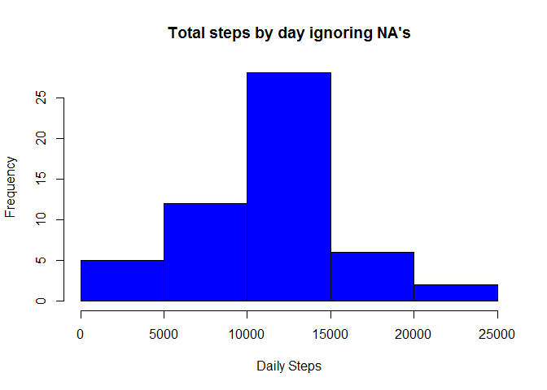
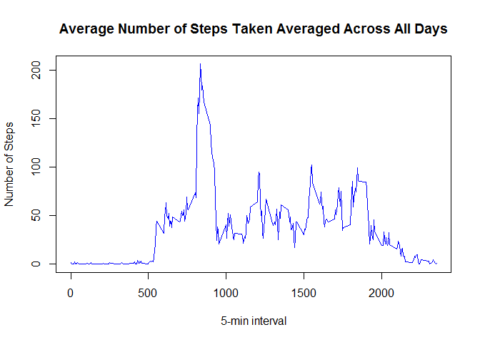
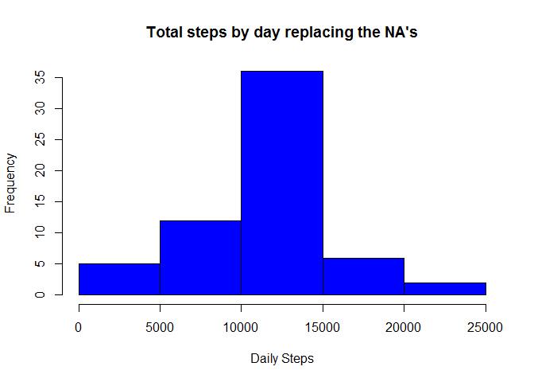
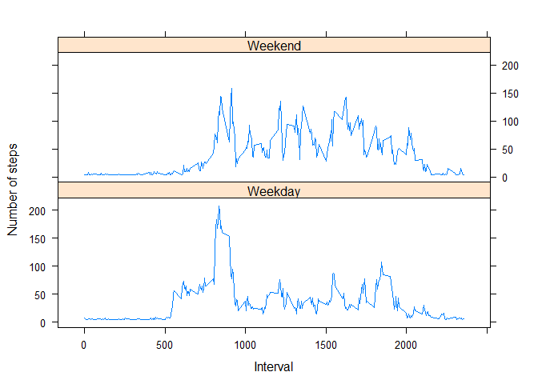

# Reproducible Research: Peer Assessment 1
## Loading and preprocessing the data
### 1. Load the data
First, make sure the "activity.zip" file is in your working directory before
running the code.


```r
dat<- read.csv(unz("activity.zip", "activity.csv"))
```
### 2. Process/transform the data (if necessary) into a format suitable for your analysis


```r
dat$date <- as.Date(dat$date)
```
Here, we convert date to date type variable.

## What is mean total number of steps taken per day?
For this part of the assignment, we ignore the missing values in the dataset.

```r
datNaRm <- na.omit(dat) # ignore NA
# Sum steps by day ignoring NA
totalSteps <-aggregate(datNaRm$steps, list(datNaRm$date), sum) 
names(totalSteps)[1]<-"date"
names(totalSteps)[2]<-"steps"
```

### 1. Make a histogram of the total number of steps taken each day

```r
hist(totalSteps$steps, main = "Total steps by day ignoring NA's", xlab =
         "Daily Steps", col = "blue")
```

 

### 2. Calculate and report the mean and median total number of steps taken per day

```r
meansteps<-mean(totalSteps[,2])
meansteps
```

```
## [1] 10766.19
```

```r
medsteps<-median(totalSteps[,2])
medsteps
```

```
## [1] 10765
```

## What is the average daily activity pattern?
### 1. Make a time series plot (i.e. type = "l") of the 5-minute interval (x-axis) and the average number of steps taken, averaged across all days (y-axis)

```r
library(plyr)
# Calculate average steps for each of daily 5-minute interval
tseries <- ddply(datNaRm,~interval, summarise, mean=mean(steps))
plot(tseries[,1], tseries[,2], type = "l", xlab = "5-min interval",
     ylab = "Number of Steps", 
     main = "Average Number of Steps Taken Averaged Across All Days", 
     col = "blue")
```

 

### 2. Which 5-minute interval, on average across all the days in the dataset, contains the maximum number of steps?

```r
tseries[which.max(tseries$mean), ] 
```

```
##     interval     mean
## 104      835 206.1698
```
On average across all the days in the dataset, the 835th interval contains the maximum number of steps, that is 206.1698.

## Imputing missing values
### 1. Calculate and report the total number of missing values in the dataset (i.e. the total number of rows with NAs)

```r
narows<-sum(is.na(dat))
narows
```

```
## [1] 2304
```

### 2. Devise a strategy for filling in all of the missing values in the dataset. 
The strategy adopted here is by replaing the NAs with the mean for that 5-minute interval.

### 3. Create a new dataset that is equal to the original dataset but with the missing data filled in.

```r
numinter<-as.numeric(unique(count(dat[2])[2])) # 288 intervals for each day
naindex<-which(is.na(dat[1])) # identify all NA entries in steps
#NA entries replaced with the mean of the 5-minute interval
dat[naindex,1]<-rep((meansteps/numinter),length(totalSteps[naindex,1])) 
```

This corresponds to total number of steps replacing the NA's given by

```r
# Sum steps by day replacing the NA's
totalSteps2 <-aggregate(dat$steps, list(dat$date), sum) 
names(totalSteps2)[1]<-"date"
names(totalSteps2)[2]<-"steps"
```

### 4. Make a histogram of the total number of steps taken each day and Calculate and report the mean and median total number of steps taken per day. Do these values differ from the estimates from the first part of the assignment? What is the impact of imputing missing data on the estimates of the total daily number of steps?

```r
hist(totalSteps2$steps, main = "Total steps by day replacing the NA's", xlab =
         "Daily Steps", col = "blue")
```

 

The mean and median are generated as follows:

```r
meansteps2<-mean(totalSteps2[,2])
meansteps2
```

```
## [1] 10766.19
```

```r
medsteps2<-median(totalSteps2[,2])
medsteps2
```

```
## [1] 10766.19
```
The median is a little bit different from previously but mean is the same.

## Are there differences in activity patterns between weekdays and weekends?

### 1. Create a new factor variable in the dataset with two levels - "weekday" and "weekend" indicating whether a given date is a weekday or weekend day.

```r
daylevel <- weekdays(dat$date)
daylevel <- gsub("Saturday|Sunday","Weekend",daylevel)
daylevel <- gsub("Monday|Tuesday|Wednesday|Thursday|Friday","Weekday",daylevel)
```
### 2. Make a panel plot containing a time series plot (i.e. type = "l") of the 5-minute interval (x-axis) and the average number of steps taken, averaged across all weekday days or weekend days (y-axis).

```r
# Total steps with weekdays and weekends identifier
totalSteps3 <- aggregate(steps ~ interval + daylevel, data = dat, mean)
library(lattice)
xyplot(steps ~ interval|daylevel, totalSteps3, type = "l",
       layout = c(1, 2), xlab = "Interval", ylab = "Number of steps")
```

 
